# 🚗 VehicleDetectionTracker: Real-time vehicle detection and tracking powered by YOLO. 🚙🚕

Effortlessly track and detect vehicles in images and videos using state-of-the-art YOLO object detection and tracking, powered by Ultralytics. Boost your computer vision project with the VehicleDetectionTracker, a versatile Python package that simplifies vehicle tracking and detection in a variety of applications. 🚙🚕

- 👀 Detect vehicles in real-time or from pre-recorded videos.
- 📍 Accurately track vehicles' positions.
- 🎨 Brand and color classification. The classifiers are based on MobileNet v3 (Alibaba MNN backend).
- 🚀 Empower traffic analysis, automated surveillance, and more.
- 🔍 Harness the capabilities of YOLO for precise object detection.

Whether you're working on traffic management, video analysis, or machine learning projects, the VehicleDetectionTracker provides the tools you need to enhance your results. Explore detailed documentation and examples on the repository, and get started with vehicle tracking in no time! 📚🚗

[](https://github.com/sergio11/vehicle_detection_tracker)
[](https://pypi.org/project/VehicleDetectionTracker/)
[](https://github.com/sergio11/vehicle_detection_tracker/blob/main/LICENSE)

## Features 🌟

- Efficient vehicle detection and tracking in images and videos.
- Accurate vehicle speed estimation in kilometers per hour (KM/H).
- Precise determination of the direction of each detected vehicle.
- Vehicle color estimation.
- Easy integration into your computer vision projects.

## Installation 🚀

You can easily install VehicleDetectionTracker using pip:

```bash
pip install VehicleDetectionTracker
```

## How Vehicle Detection Works

Vehicle detection is a crucial component of many traffic management and surveillance systems. In this section, we'll explain how vehicle detection works using a simplified description.

### 1. Video Input
- The process begins with a video input, typically captured from cameras placed in various locations, such as roads, highways, or parking lots.

### 2. Frame Extraction
- The video is composed of a sequence of frames (images). Vehicle detection works on each frame individually. These frames are extracted from the video stream.

### 3. YOLO Model
- A specialized model, often based on YOLO (You Only Look Once) or similar deep learning frameworks, is used for vehicle detection. This model is pre-trained to recognize vehicles.

### 4. Object Detection
- Each frame is processed by the YOLO model, which analyzes the image and identifies objects present. In this case, it's looking for vehicles. The model detects vehicles by drawing bounding boxes around them and assigning a confidence score to each detection.

### 5. Tracking
- To keep track of vehicles over time, the system uses a tracking mechanism. This ensures that the same vehicle is consistently recognized as it moves through the frames. Tracking may involve assigning unique IDs to vehicles and following their movements.

### 6. Attribute Calculation
- The system calculates several attributes for each detected vehicle:
  - **Speed:** By analyzing the position of the vehicle in successive frames and measuring the time difference, the system calculates the vehicle's speed.
  - **Direction:** It determines the vehicle's direction of movement by comparing its position in different frames. This can be done by calculating the angle of motion.
  - **Reliability:** The reliability of the calculated speed and direction is assessed based on the number of samples used. More samples often lead to higher reliability.

### 7. Information Collection
- Information about each detected vehicle, such as its type (car, truck, etc.), coordinates (position in the frame), speed, direction, and reliability, is collected and stored.

### 8. Annotated Frames
- Annotated frames are generated by adding visual overlays to the original frames. These overlays include tracking lines and bounding boxes around detected vehicles.

### 9. Display or Analysis
- The annotated frames can be displayed for real-time monitoring, analysis, or traffic management. They provide a visual representation of vehicle movements, and the collected data can be used for various purposes, including traffic flow analysis, incident detection, and more.

### 10. Data Output
- The processed data, including vehicle attributes and annotated frames, can be stored, analyzed, or further processed according to the requirements of the application or system.

In summary, vehicle detection involves using a deep learning model to identify vehicles in video frames, tracking their movements, calculating attributes like speed and direction, and providing this information for display or analysis. This technology is a key component in traffic management, surveillance, and various other applications where vehicle monitoring is essential.

## Explanation of Detection Results JSON.

```
0: 384x640 1 car, 171.0ms
Speed: 5.0ms preprocess, 171.0ms inference, 2.0ms postprocess per image at shape (1, 3, 384, 640)

{
  "number_of_vehicles_detected": 1,  // Number of vehicles detected in this frame
  "detected_vehicles": [  // List of information about detected vehicles
    {
      "vehicle_id": 5,  // Unique identifier for the detected vehicle
      "vehicle_type": "car",  // Type of the detected vehicle
      "detection_confidence": 0.4797525107860565,  // Confidence score of the detection
      "color_info": '[{"color": "Black", "prob": "0.2470433"}, {"color": "White", "prob": "0.21236196"}, {"color": "Blue", "prob": "0.15445676"}]',  // Detected vehicle color information
      "model_info": '[{"make": "Jeep", "model": "Wrangler", "prob": "0.022544071"}, {"make": "Ford", "model": "Mustang", "prob": "0.014573687"}, {"make": "Honda", "model": "Civic", "prob": "0.010537574"}]',  // Detected vehicle make and model information
      "speed_info": {
        "kph": 68.1191847125589,  // Calculated speed in kilometers per hour (kph)
        "reliability": 1.0,  // Reliability of the speed measurement
        "direction_label": "Top Left",  // Label indicating the direction of the vehicle
        "direction": -2.2559461480857093  // Direction in radians
      }
    }
  ]
}
```

## Usage 📷

You can quickly get started with VehicleDetectionTracker to detect and track vehicles in images and videos. Below are two usage examples, each tailored to different scenarios:

### Example 1: Real-Time Video Stream (OpenCV)

This example demonstrates how to use VehicleDetectionTracker to process a real-time video stream using OpenCV. Simply provide the URL of the video stream to get started:

```python
from VehicleDetectionTracker.VehicleDetectionTracker import VehicleDetectionTracker

video_path = "[[YOUR_STREAMING_SOURCE]]"
vehicle_detection = VehicleDetectionTracker()
result_callback = lambda result: print({
    "number_of_vehicles_detected": result["number_of_vehicles_detected"],
    "detected_vehicles": [
        {
            "vehicle_id": vehicle["vehicle_id"],
            "vehicle_type": vehicle["vehicle_type"],
            "detection_confidence": vehicle["detection_confidence"],
            "color_info": vehicle["color_info"],
            "model_info": vehicle["model_info"],
            "speed_info": vehicle["speed_info"]
        }
        for vehicle in result['detected_vehicles']
    ]
})
vehicle_detection.process_video(video_path, result_callback)
```

###  Example 2: Kafka Topic Processing

For more advanced use cases, VehicleDetectionTracker can also be integrated with Apache Kafka for processing video frame by frame:

```python
from confluent_kafka import Consumer, KafkaError
from VehicleDetectionTracker.VehicleDetectionTracker import VehicleDetectionTracker
import json

conf = {
    'bootstrap.servers': '192.168.1.39:9092"',  # Configure this to your Kafka broker's address.
    'group.id': 'my-group-1',
    'auto.offset.reset': 'earliest'
}

topic = 'iot-camera-frames'
consumer = Consumer(conf)
consumer.subscribe([topic])

vehicleDetection = VehicleDetectionTracker()

while True:
    msg = consumer.poll(1.0)

    if msg is None:
        continue
    if msg.error():
        if msg.error().code() == KafkaError._PARTITION_EOF:
            print('End of partition, message read: {} [{}] at offset {}'.format(
                msg.key(), msg.partition(), msg.offset()))
        else:
            print('Kafka error: {}'.format(msg.error()))
    else:
        # Process the message (a frame) received from Kafka
        payload = json.loads(msg.value())
        
        mac_address = payload.get('mac_address', '')
        frame_timestamp = payload.get('frame_timestamp', '')
        frame_data = payload.get('frame_data', '')

        # Process the frame with the tracker
        results = vehicleDetection.process_frame_base64(frame_data, frame_timestamp)
    
        # Optionally, you can access the MAC address and timestamp for further processing
        print(f"MAC Address: {mac_address}")
        print(f"Timestamp: {frame_timestamp}")
        result_callback = lambda result: print({
            "number_of_vehicles_detected": result["number_of_vehicles_detected"],
            "detected_vehicles": [
                {
                    "vehicle_id": vehicle["vehicle_id"],
                    "vehicle_type": vehicle["vehicle_type"],
                    "detection_confidence": vehicle["detection_confidence"],
                    "color_info": vehicle["color_info"],
                    "model_info": vehicle["model_info"],
                    "speed_info": vehicle["speed_info"]
                }
                for vehicle in result['detected_vehicles']
            ]
        })
        result_callback(results)

consumer.close()
```

These examples showcase the flexibility of VehicleDetectionTracker and its ability to adapt to various real-world scenarios. Explore the repository's documentation and examples for more in-depth guidance.

### Screenshots 📷

Here are some screenshots that demonstrate the functionality of VehicleDetectionTracker:

| Screenshot 1 | Screenshot 2 |
|-------------- |-------------- |
|  | 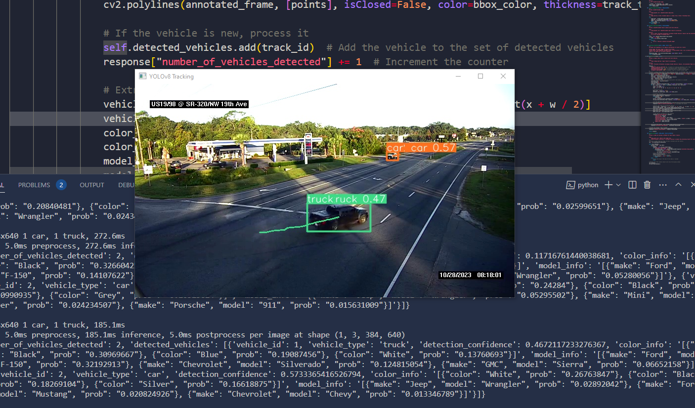 |

| Screenshot 3 | Screenshot 4 |
|-------------- |-------------- |
| 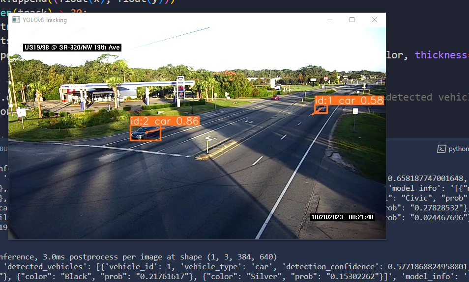 | 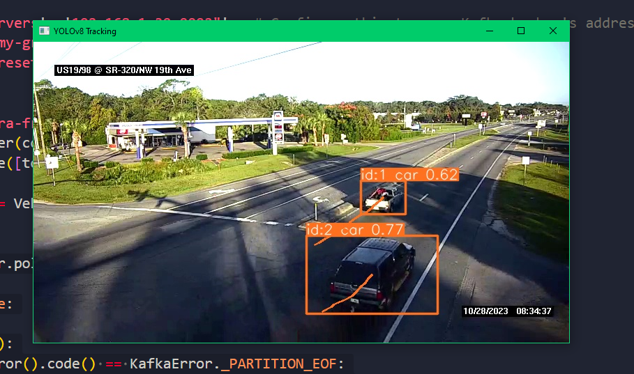 |

| Screenshot 5 | Screenshot 6 |
|-------------- |-------------- |
| 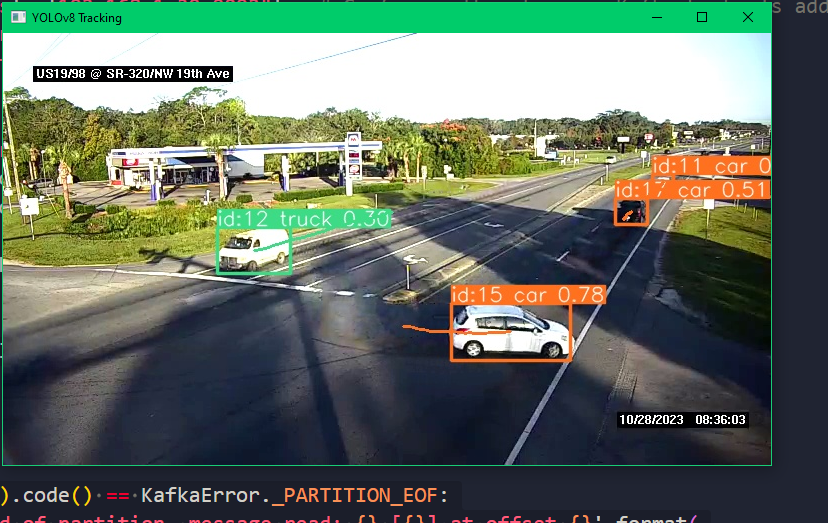 | 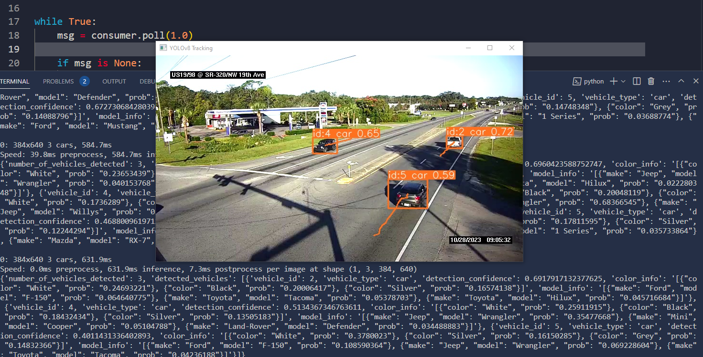 |

| Screenshot 7 | Screenshot 8 |
|-------------- |-------------- |
| 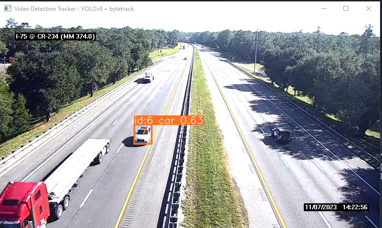 | 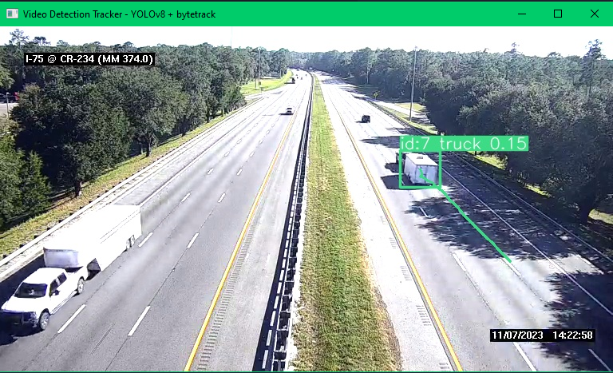 |

| Screenshot 9 | Screenshot 10 |
|-------------- |-------------- |
| 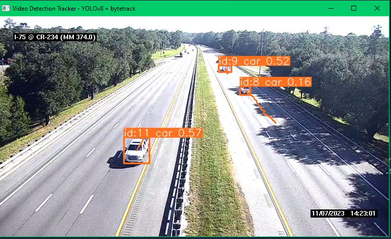 | 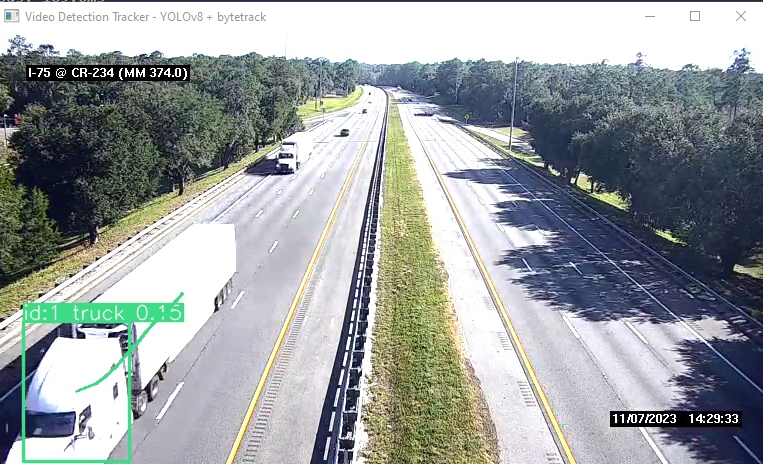 |

| Screenshot 11 | Screenshot 12 |
|-------------- |-------------- |
| 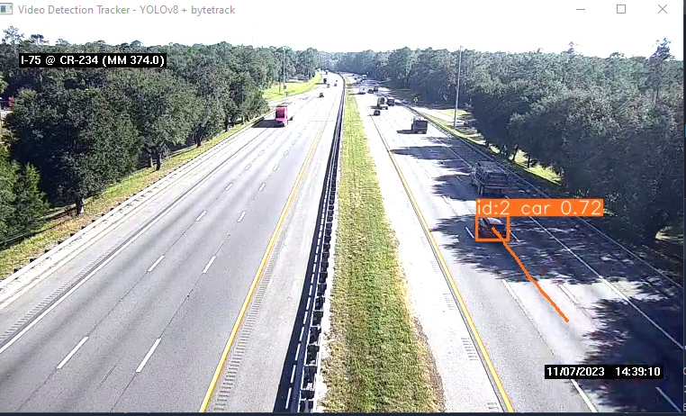 | 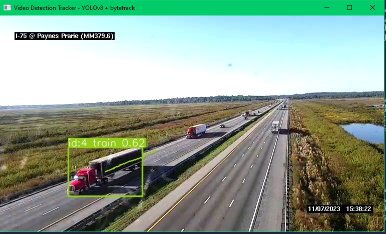 |


## License 📜

This project is licensed under the MIT License - see the [LICENSE](https://github.com/sergio11/vehicle_detection_tracker/blob/main/LICENSE) file for details.

## Acknowledgments 🙏

- This package is powered by [ultralytics YOLO](https://github.com/ultralytics/ultralytics) for object detection.
- Special thanks to the open-source community for their contributions.

## Contribution

Contributions to VehicleDetectionTracker are highly encouraged! If you're interested in adding new features, resolving bugs, or enhancing the project's functionality, please feel free to submit pull requests.

## Get in Touch 📬

VehicleDetectionTracker is developed and maintained by **Sergio Sánchez Sánchez** (Dream Software). Special thanks to the open-source community and the contributors who have made this project possible. If you have any questions, feedback, or suggestions, feel free to reach out at  [dreamsoftware92@gmail.com](mailto:dreamsoftware92@gmail.com).

## Happy Tracking! 🚀👁️

[](https://github.com/sergio11/vehicle_detection_tracker)
[](https://pypi.org/project/VehicleDetectionTracker/)

## Visitors Count


## Please Share & Star the repository to keep me motivated.
  <a href = "https://github.com/sergio11/vehicle_detection_tracker/stargazers">
     
  </a>
